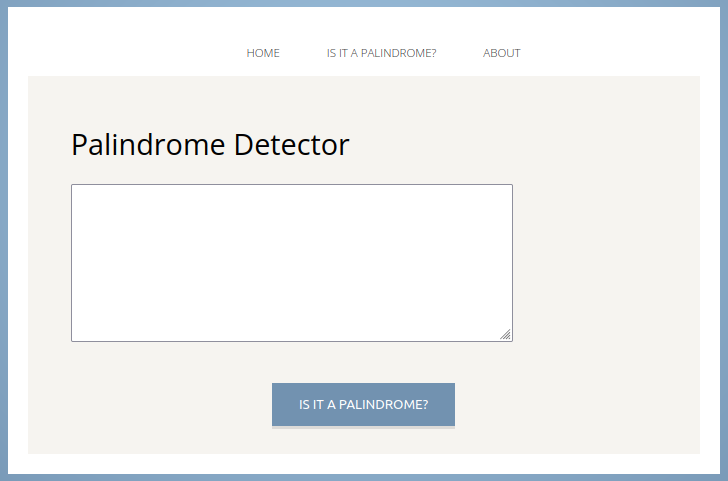

<!-- Improved compatibility of back to top link: See: https://github.com/othneildrew/Best-README-Template/pull/73 -->
<a name="readme-top"></a>
<!--
*** Thanks for checking out the Best-README-Template. If you have a suggestion
*** that would make this better, please fork the repo and create a pull request
*** or simply open an issue with the tag "enhancement".
*** Don't forget to give the project a star!
*** Thanks again! Now go create something AMAZING! :D
-->


<!-- PROJECT SHIELDS -->
<!--
*** I'm using markdown "reference style" links for readability.
*** Reference links are enclosed in brackets [ ] instead of parentheses ( ).
*** See the bottom of this document for the declaration of the reference variables
*** for contributors-url, forks-url, etc. This is an optional, concise syntax you may use.
*** https://www.markdownguide.org/basic-syntax/#reference-style-links
-->


<!-- PROJECT LOGO -->
<br />
<div align="center">
  <h3 align="center">Palindrome App Sinatra</h3>

  <p align="center">
    A palindrome detector maded using Ruby language, Sinatra framework and an own personal gem created and published to detect palindromes.
    <br />
    <a href="https://github.com/AgustinPalmaM/palindrome_app_sinatra"><strong>Explore the docs »</strong></a>
    <br />
    <br />
    <a href="https://shrouded-crag-85355-aaabae8147b9.herokuapp.com/">View Demo</a>
  </p>
</div>




This is a web app maded with the framework Sinatra, programming language Ruby and for this project i create and publish a Ruby Gem to detect when a word or integer is a Palindrome.

This project was maded following the learning from the good course Learn Enough Ruby to be Dengerous, at this point i have learned about Strings, Arrays, Native Objects as Math, Time, Regular Expressions and Hashes, Functions and Blocks, Functional programming using methods like Map - Select - Reduce, Objects and Classes, TDD red-green-refactor, Shell Scripts using the File class to read and write files or read urls using gems like open-uri and also manipulating the DOM using a gem called Nokogiri, finally i have created this web app called Palindrome App.

<!-- <p align="right">(<a href="#readme-top">back to top</a>)</p> -->


### Built With

* [![Ruby][Ruby]][Ruby-url]
* [![Sinatra][Sinatra]][Sinatra-url]


<!-- <p align="right">(<a href="#readme-top">back to top</a>)</p> -->


<!-- GETTING STARTED -->
## To use this project locally

You need to have installed Ruby, you can check more information here: [https://www.ruby-lang.org/en/](https://www.ruby-lang.org/en/)


Then you can clone this repository and add necesary gems into the Gemfile using bundler


1. Clone the repo
   ```sh
   git clone https://github.com/AgustinPalmaM/palindrome_app_sinatra.git
   ```
2. Install Gems
   ```sh
   bundle install
   ```

<!-- <p align="right">(<a href="#readme-top">back to top</a>)</p> -->


<!-- CONTACT -->
## Contact

Agustin Palma M - [Linkedin](https://www.linkedin.com/in/agustinpalmam/) - palma.agustin7@gmail.com

Project Link: [https://github.com/AgustinPalmaM/palindrome_app_sinatra](https://github.com/AgustinPalmaM/palindrome_app_sinatra)

<p align="right">(<a href="#readme-top">back to top</a>)</p>

<!-- MARKDOWN LINKS & IMAGES -->
<!-- https://www.markdownguide.org/basic-syntax/#reference-style-links -->
[contributors-shield]: https://img.shields.io/github/contributors/othneildrew/Best-README-Template.svg?style=for-the-badge
[contributors-url]: https://github.com/othneildrew/Best-README-Template/graphs/contributors
[forks-shield]: https://img.shields.io/github/forks/othneildrew/Best-README-Template.svg?style=for-the-badge
[forks-url]: https://github.com/othneildrew/Best-README-Template/network/members
[stars-shield]: https://img.shields.io/github/stars/othneildrew/Best-README-Template.svg?style=for-the-badge
[stars-url]: https://github.com/othneildrew/Best-README-Template/stargazers
[issues-shield]: https://img.shields.io/github/issues/othneildrew/Best-README-Template.svg?style=for-the-badge
[issues-url]: https://github.com/othneildrew/Best-README-Template/issues
[license-shield]: https://img.shields.io/github/license/othneildrew/Best-README-Template.svg?style=for-the-badge
[license-url]: https://github.com/othneildrew/Best-README-Template/blob/master/LICENSE.txt
[linkedin-shield]: https://img.shields.io/badge/-LinkedIn-black.svg?style=for-the-badge&logo=linkedin&colorB=555
[linkedin-url]: https://linkedin.com/in/othneildrew
[product-screenshot]: images/screenshot.png
[Next.js]: https://img.shields.io/badge/next.js-000000?style=for-the-badge&logo=nextdotjs&logoColor=white
[Next-url]: https://nextjs.org/
[Ruby]: https://img.shields.io/badge/Ruby-CC342D?style=for-the-badge&logo=ruby&logoColor=white%22
[Ruby-url]: https://www.ruby-lang.org/en/ 
[Sinatra]: https://img.shields.io/static/v1?style=for-the-badge&message=Ruby+Sinatra&color=000000&logo=Ruby+Sinatra&logoColor=FFFFFF&label=
[Sinatra-url]: https://sinatrarb.com/
